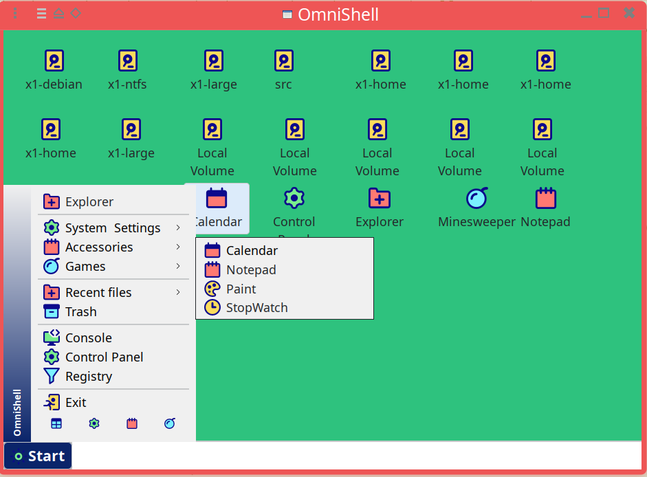
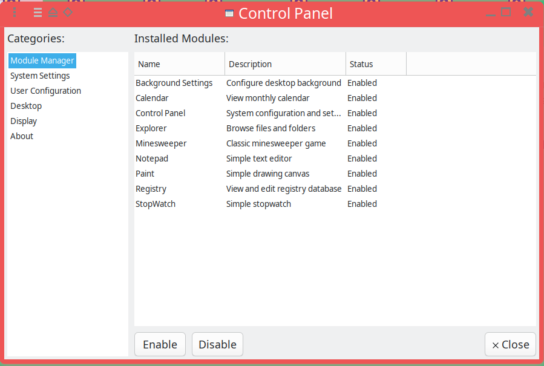
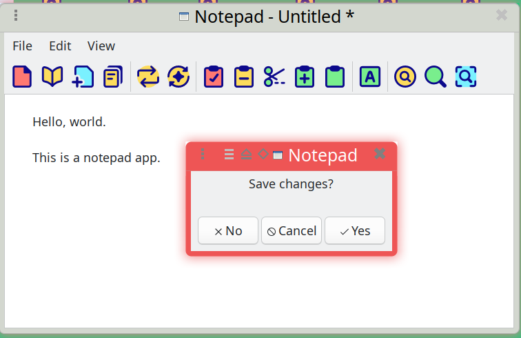

## OmniShell Desktop Environment

OmniShell is a **desktop-like shell environment** implemented as a single wxWidgets application.  
It aims to provide a self-contained, Windows‑style desktop experience (desktop, taskbar, start menu, tray, apps)
inside one process, with strong boundaries between user-facing UI and underlying storage/security layers.

### Screenshots

| Name        | Screenshot     |
|-------------|----------------|
| Desktop     |  |
| ControlPanel|  |
| Notepad     |  |

### Motivation

- **Unified application shell**: Many enterprise systems ship dozens of small utilities, daemons, and UIs. OmniShell
  gives them a single, coherent shell where apps share a common UX, windowing model, and integration points.
- **Security & isolation**: Instead of letting every component talk directly to the host filesystem, the
  **Virtual File System (VFS)** layer centralizes access, adds auditing, and allows secure backends
  (encrypted volumes, network volumes, memory-backed storage, etc.).
- **Embedded / kiosk scenarios**: For controlled environments (kiosks, appliances, lab terminals) it is useful to ship
  a “mini desktop” that boots directly into a curated workspace, without exposing a full general-purpose desktop.
- **Consistency across platforms**: By building on wxWidgets and the VFS abstraction, the same desktop shell
  can be ported across OSes while keeping behavior and policies consistent.

### Core Concepts & Features

- **Desktop shell UI**
  - Desktop window with icons and drag-and-drop
  - Taskbar with running applications and status
  - Start menu with search, categories, and app launch
  - System tray with notifications and background services
- **Module-based applications**
  - Applications are **modules** registered in a central registry, with a defined lifecycle
  - Notepad (Scintilla-based text editor)
  - Control Panel (configuration center: module manager, system settings, preferences)
  - Service-style modules for background tasks and tray utilities
- **Virtual File System (VFS)**
  - Pluggable volume backends (local, encrypted “seczure” devices, in-memory ZIP, etc.)
  - Access control via ACLs, user auth, and allow/deny lists
  - Path normalization, auditing, and consistent error semantics across backends
- **Service & tray infrastructure**
  - Long‑running modules integrated into the tray
  - Notification APIs for user feedback
- **Extensibility**
  - Clear C++ module API (see `OMNISHELL_README.md` for examples)
  - Designed so third parties can ship their own OmniShell apps and services

### Example Applications / Use Cases

- **Operator console** for a fleet of backend services, where each module is a management/monitoring UI.
- **Secure workstation shell** that only exposes approved applications and VFS volumes.
- **Developer or QA workbench**, bundling internal tools (logs viewer, config editors, diagnostics) into one shell.
- **Demo environment** where a product ships with a curated desktop containing just the apps relevant to that product.

### High‑Level Architecture

At a very high level, OmniShell is split into:

- **Core / module system**
  - Module base class, registration macros, and lifecycle management
  - Service manager and tray integration
- **Shell**
  - Desktop window, icons, background
  - Taskbar and start menu
  - Window chrome and focus management
- **Applications**
  - Notepad, Control Panel, and future apps (e.g., paint, file manager, etc.)
- **VFS & storage**
  - Volume abstraction (`Volume`, `VolumeManager`, and friends)
  - Volume implementations (local, encrypted, memory ZIP)
  - Access control, auth, and audit logging

### Repository Layout (high level)

```text
omnishell/
├── src/
│   ├── shell/         # Desktop, taskbar, start menu, window chrome
│   ├── app/           # Built-in apps (notepad, control panel, ...)
│   ├── volume/        # Virtual File System (VFS) implementation
│   └── ...            # Core, security, IO, daemon, etc.
├── assets/            # Icons and UI assets
├── third_party/       # Third-party dependencies
├── scripts/           # Helper scripts
└── build/             # Meson/ninja build output (generated)
```

### Building

**Prerequisites**

- wxWidgets 3.0+
- Meson build system
- C++17-compatible compiler
- Boost
- libcurl
- OpenSSL
- zlib
- ICU

**Build & Run**

```bash
meson setup build      # configure
ninja -C build         # build
./build/omnishell      # run OmniShell
```

### Development Workflow

- **Add a new module / app**
  - Implement a class derived from the module base class (see `OMNISHELL_README.md` for the full example).
  - Register it with the module registry via the provided macro.
  - Add it to the start menu (and optionally to the desktop/taskbar) via the shell configuration.
- **Integrate with the VFS**
  - Use `Volume` / `VolumeFile` APIs instead of raw filesystem access.
  - Decide whether your module needs local, encrypted, or in-memory volumes.
  - Honor access-control failures (e.g., `AccessException`) and surface user‑friendly errors.
- **Contribute UI / assets**
  - Add icons and mappings under `assets/` (see the assets documentation below).
  - Use the existing visual language so new apps feel native to the shell.

### License

Part of the OmniShell project.
